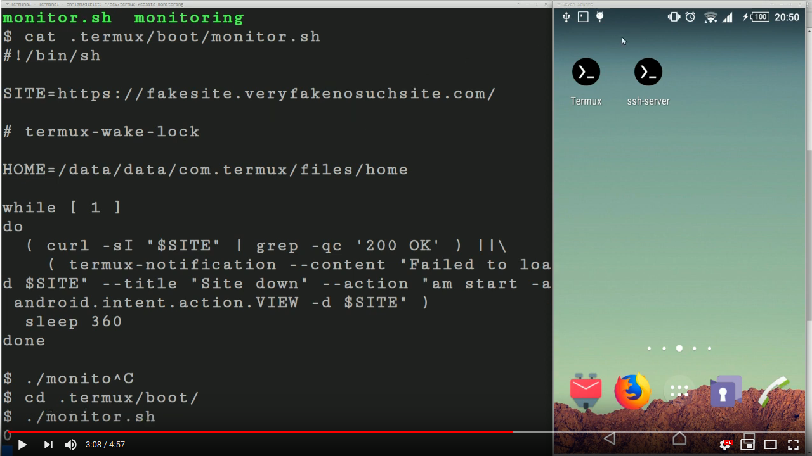
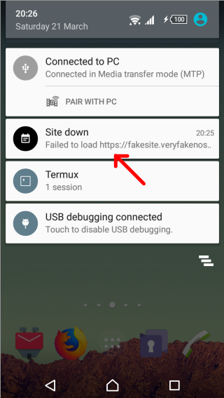

Simple website monitoring using Termux and Android.

This script will test a site every five minutes. If it's down a notification will be shown. Tapping the notification will open the browser at the site URL.

# How to

 * Install [Termux and Termux Boot](https://termux.com/) from Google Play or F-Droid.
 * Get [SSH access working](https://wiki.termux.com/wiki/Remote_Access#Using_the_SSH_server) so you have remote access to your phone.
 * Edit the file [`monitor.sh`](./monitor.sh) in this repo and change the `SITE` variable to your site.
 * Copy it to your phone and install in `.termux/boot/monitor.sh` so it starts at boot.
 * Reboot your phone and you should see the icon of it running.
 * You can also just run the script to test it: `./monitor.sh`.

